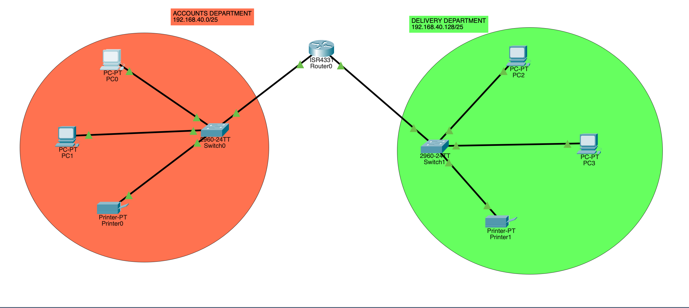

# Problem Statement

Design a CISCO packet tracer to connect ACCOUNTS and DELIVERY departments through the following

1. Each department should contain at least 2 PCs
2. Appropriate number of switches and routers should be used in the network
3. Using the given network address 102.168.40.0, all interfaces should be configured with appropriate IP addresses, subnet mask and gateways
4. All devices in the network should be connected using appropriate cables
5. Test the connectivity between ACCOUNTS and DELIVERY department. PCs in delivery department should be able to ping the PCs in ACCOUNTS department

# Answers



number of subnets = 2
=> bits required for subnet addressing = 1
and bits for host addressing = 7

## subnet 1

- subnet mask = 255.255.255.128
- Network Id = 192.168.40.0
- Valid host address ranges = 192.168.40.1 - 192.168.40.126
- broadcast ID = 192.168.40.127

## subnet 2

- subnet mask = 255.255.255.128
- Network Id = 192.168.40.128
- Valid host address ranges = 192.168.40.129 - 192.168.40.254
- broadcast ID = 192.168.40.255

## router configuration

```
en
config t
int range gig0/0/0-1
no shutdown
exit


int gig0/0/0
ip address 192.168.40.1 255.255.255.128

int gig0/0/1
ip address 192.168.40.129 255.255.255.128

do wr

exit
do show stat
exit
```

# host configuration

- set the ip address, network mask and default gateway with the appropriate values
