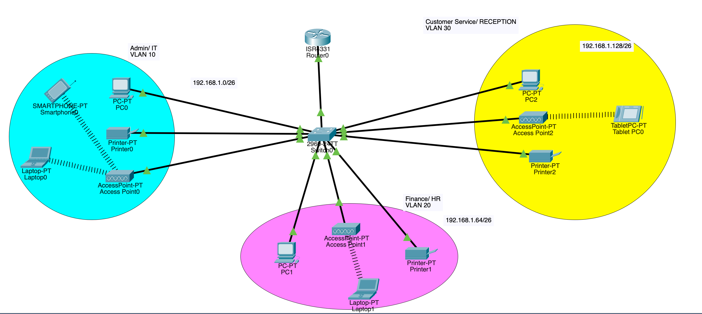

# Problem Statement

XYZ company is a fast growing company in Eastern Australia with more than 2 million customers globally. The company deals with selling and buying of food items, which are basically operated from the headquarters. The company is intending to open a branch near the local village Bonalbo. Thus, the company requieres young IT graduates to design the network for the branch. The network is intended to operate separately from the HQ network.

Being a small network, the company has the following requirements during implementation;

1. One router and one swtich to be used
2. 3 departments(Admin/IT, Finance/HR and Customer Service/Reception)
3. Each department is required to be in different VLANs
4. Host devices in the network are required to obtain iPv4 address automatically.
5. Devices in all the departments are required to communicate with each other.

Assume the ISP gave out a base network of 192.168.1.0, you as the young network engineer who has been hired, design and implement a network considering the above requirements.

# Answers



## addresssing

number of subnets = 3
=> bits required for subnet addressing = 2
=> block size = 2^6 = 64

### 1st subnet

- subnet mask = 255.255.255.192
- Network Id = 192.168.1.0
- Valid host address ranges = 192.168.1.1 - 192.168.1.62
- broadcast ID = 192.168.1.63

### 2nd subnet

- subnet mask = 255.255.255.192
- Network Id = 192.168.1.64
- Valid host address ranges = 192.168.1.65 - 192.168.1.126
- broadcast ID = 192.168.1.127

### 3rd subnet

- subnet mask = 255.255.255.192
- Network Id = 192.168.1.128
- Valid host address ranges = 192.168.1.129 - 192.168.1.90
- broadcast ID = 192.168.1.191

## Configuring VLAN

### switch configuration

```
en
conf t
int range fa0/2-4
switchport mode access
switchport access vlan 10

int range fa0/5-7
switchport mode access
switchport access vlan 20

int range fa0/8-10
switchport mode access
switchport access vlan 30

int fa0/1
switchport mode trunk

do wr
exit
do sh start
exit
```

### access point configuration

access point -> config -> port 1 ->specify SSID and WPA2-PSK with PSK pass phrase

### router configuration

setting up sub interfaces

```
en
conf t
int gig0/0/0
no shutdown

int gig0/0/0.10
encapsulation dot1Q 10
ip address 192.168.1.1 255.255.255.192

int gig0/0/0.20
encapsulation dot1Q 20
ip address 192.168.1.65 255.255.255.192

int gig0/0/0.30
encapsulation dot1Q 30
ip address 192.168.1.129 255.255.255.192

do wr
do sh start
exit
```

the ip address specified after each encapsulation will act as the default gateway ip for the vlan

### DHCP configuration

at router

```
en
conf t
service dhcp
ip dhcp pool Admin-Pool
network 192.168.1.0 255.255.255.192
default-router 192.168.1.1
dns-server 192.168.1.1
domain-name Admin.com
exit

ip dhcp pool Finance-Pool
network 192.168.1.64 255.255.255.192
default-router 192.168.1.65
dns-server 192.168.1.65
domain-name Finance.com
exit

ip dhcp pool Reception-Pool
network 192.168.1.128 255.255.255.192
default-router 192.168.1.129
dns-server 192.168.1.129
domain-name Reception.com
exit

```

tick the checkbox against DHCP in the ip configuration of host devices

at laptop
physical configuration-> add wireless interface
