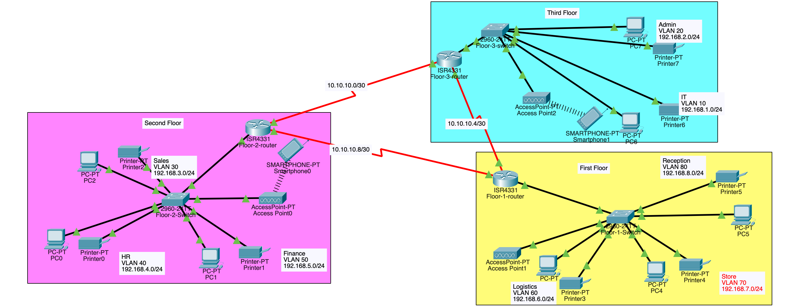

# Problem Statement

As a part of your end year networking project, you are required to design and implement Vic Modern Hotel network. The hotel has three floors; in the first floor there are three departments(Reception, store and Logistics), in the second floor there are three departments(Finance, HR and Sales/Marketing), while ther third floor hosts the IT and Admin. Therefor, the following are part of the considerations during the design and implementation.

1. There should be three routers connecting each floor(all placed in the server room in the IT department).
2. All routers should be connected to each other using serial DCE cable.
3. The network between the routers should be 10.10.10.0/30, 10.10.10.4/30, 10.10.10.8/30
4. Each floor is expected to have one switch(placed in the respective floor)
5. Each floor is expected to have Wifi networks connected to laptops and phones.
6. Each department is expected to have a printer
7. Each departrment is expected to be in different VLAn with the following details

1st Floor;

- Reception- VLAN 80, Network of 192.168.8.0/24
- Store- VLAN 70, Network of 192.168.7.0/24
- Logistics: VLAN 60, Network of 192.168.6.0/24

2nd Floor;

- Finance- VLAN 50, Network of 192.168.5.0/24
- HR- VLAN 40, Network of 192.168.4.0/24
- Sales- VLAN 30, Network of 192.168.3.0/24

3rd Floor;

- Admin:- VLAN 20, Network of 192.168.2.0/24
- IT- VLAN 10, Network of 192.168.1.0/24

8. Use OSPF as the routing protocol to advertise routes
9. All devices in the network are expected to obtain IP address dynamically with their respective router configured as the DHCP server.
10. All devices in the network are expected to communicate with each otehr
11. Configure SSH in all the routers for remote login
12. In IT department, add PC called Test-PC to ort fa0/1 and use it to test remote login
13. Configure port security to IT-dept swtich to allow only Test-PC to access port fa0/1
    (user sticky method to obtain mac-address with violation mode of shutdown)

# Answer



setting up serial interface for router

- add NIM-2T Cisco serial interface to the router
- use DCE cables to connect between the routers

## router configuration

```
en
conf t
int Se0/1/0
no sh
clock rate 64000
ip address 10.10.10.1 255.255.255.252

int se0/1/1
no sh
clock rate 64000
ip address 10.10.10.5 255.255.255.252

int Gig0/0/0
no sh

do wr
exit
```

repeat with other routers

## swtich configuration

```
en
conf t
int range fa0/2-3
switchport mode access
switchport access vlan 60

int range fa0/4-5
switchport mode access
switchport access vlan 70

int range fa0/6-7
switchport mode access
switchport access vlan 80

int fa0/1
switchport mode trunk

do wr
exit

```

repeat the procedure with the other swtiches

### interfaces and dhcp service

```
en
conf t
int gig0/0/0.80
encapsulation dot1Q 80
ip address 192.168.8.1 255.255.255.0

int gig0/0/0.70
encapsulation dot1Q 70
ip address 192.168.7.1 255.255.255.0

int gig0/0/0.60
encapsulation dot1Q 60
ip address 192.168.6.1 255.255.255.0
exit

service dhcp
ip dhcp pool Reception
network 192.168.8.0 255.255.255.0
default-router 192.168.8.1
dns-server 192.168.8.1

ip dhcp pool Store
network 192.168.7.0 255.255.255.0
default-router 192.168.7.1
dns-server 192.168.7.1

ip dhcp pool Logistics
network 192.168.6.0 255.255.255.0
default-router 192.168.6.1
dns-server 192.168.6.1

```

repeat with according values for each router

### routing and advertising

at router

```
en
conf t
router ospf 10
network 10.10.10.4 255.255.255.252 area 0
network 10.10.10.8 255.255.255.252 area 0
network 192.168.8.0 255.255.255.0 area 0
network 192.168.7.0 255.255.255.0 area 0
network 192.168.6.0 255.255.255.0 area 0

```

repeat for three routers
