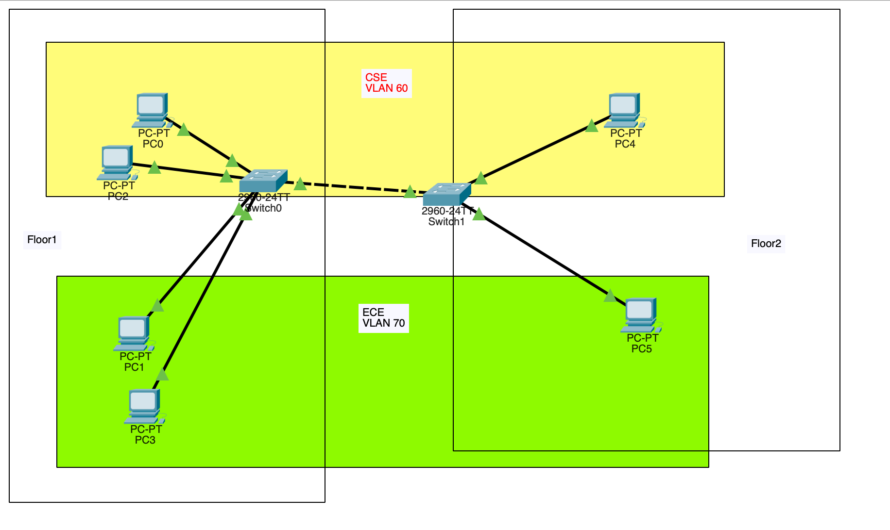

# Problem Statement

Create two subnets Floor1 and Floor2 with 4 and 2 devices respectively within it. Create 2 VLANs CSE and ECE. CSE should contain 2 host devices within the Floor1 and one host from Floor2. The rest of the devices should accordingly be placed VLAN ECE.

1. Check the connectivity within VLANs.
2. Ensure that inter VLAN traffic is restricted

# Answers



## VLAN configuration

at switch

```
en
show vlan
conf t

vlan 30
name CSE
int range fa0/1-2
switchport mode access
switchport access vlan 30


vlan 70
name ECE
int range fa0/3-4
switchport mode access
switchport access vlan 70

do wr
exit
```
